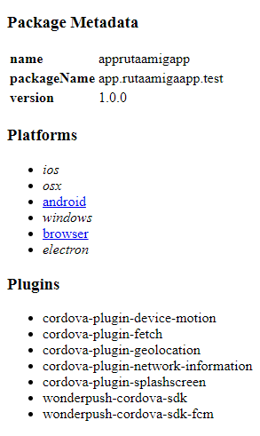

# Ejecutar app mobile.

## Pasos:

## Deployment

1) Seguir los pasos de instalacion de cordova que aparecen en el siguiente link:
```bash
  https://cordova.apache.org/docs/en/11.x/guide/cli/
```

2) Instalar java y jdk:
```bash
  https://www.java.com/es/download/help/windows_manual_download.html
```


3) Configurar las variables de entorno java en windows
```bash
  https://cordova.apache.org/docs/en/11.x/guide/cli/
```


## Desplegar cordova app:
Comandos:
```bash
Aliases
    build -> cordova prepare && cordova compile
    emulate -> cordova run --emulator

Options
    -v, --version ...................... prints out this utility's version
    -d, --verbose ...................... debug mode produces verbose log output for all activity,
    --no-update-notifier ............... disables check for CLI updates
    --nohooks .......................... suppress executing hooks
                                         (taking RegExp hook patterns as parameters)

Examples
    cordova create myApp org.apache.cordova.myApp myApp <-- Crear aplicacion cordova
    cordova plugin add cordova-plugin-camera <-- instalar plugin en cordova
    cordova platform add android <-- añadir una plataforma
    cordova plugin add cordova-plugin-camera --nosave
    cordova platform add android --nosave
    cordova requirements android
    cordova build android --verbose
    cordova run android <-- correr cordova app
    cordova build android --release -- --keystore="..\android.keystore" --storePassword=android --alias=mykey
    cordova config ls

```

## Documentation

Importante:

Correr el servidor cordova y seleccionar la plataforma a visualizar.
 
```bash
cordova serve
```



Cada que se realice un cambio ejecutar el comando :
```bash
cordova build android
```

